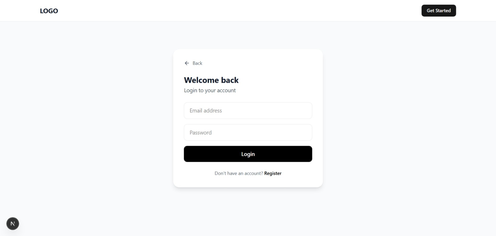
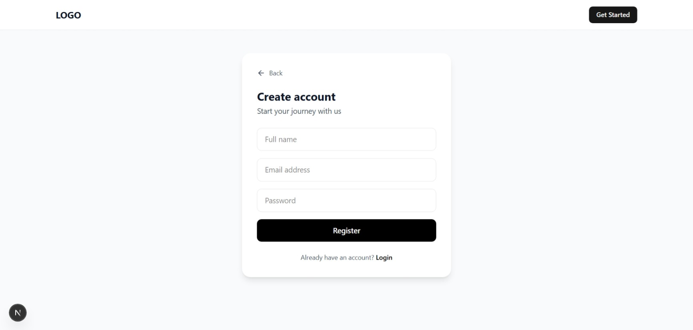
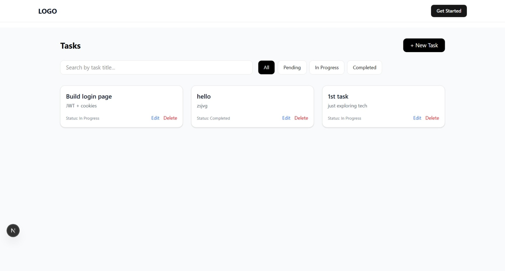

# 🚀 Internship-Pro – Full Stack Task Management Application

Internship-Pro is a **full-stack task management web application** built using **Next.js (App Router)**.  
The project demonstrates **secure JWT-based authentication**, **protected routes**, and **task CRUD operations** with a modern, responsive UI.

This project was developed as part of a **Frontend Developer / Full Stack assignment**, focusing on real-world practices such as authentication, API security, and clean UI/UX.

---

## 🌐 Live Demo

- **Live URL:** https://your-project.vercel.app  
- **API Base URL:** https://your-project.vercel.app/api  

---

## 🧠 Project Overview

This application allows users to:

- Register and log in securely
- Stay authenticated using JWT (stored in HTTP-only cookies)
- Access a protected dashboard
- Create, read, update, and delete tasks
- Search tasks by title
- Filter tasks by status
- Log out securely

The app is fully responsive and works seamlessly across **desktop, tablet, and mobile devices**.

---

## ✨ Features

### 🔐 Authentication
- User registration
- User login
- JWT-based authentication
- HTTP-only cookies (secure)
- `/api/auth/me` endpoint to verify logged-in user
- Logout functionality
- Protected routes using Next.js middleware

### 📝 Task Management
- Create new tasks
- View all user-specific tasks
- Update existing tasks
- Delete tasks
- Search tasks by title
- Filter tasks by status:
  - Pending
  - In Progress
  - Completed

### 🛡️ Security
- JWT verification on all protected APIs
- Tasks are accessible only to their owner
- No sensitive data stored in localStorage
- Server-side authorization checks

---

## 🛠️ Tech Stack

### Frontend
- **Next.js (App Router)**
- **React**
- **Tailwind CSS**
- **shadcn/ui**
- Fully responsive design

### Backend
- **Next.js API Routes**
- **MongoDB + Mongoose**
- **JWT Authentication**
- **bcryptjs** (password hashing)

### Deployment
- **Vercel**
- **MongoDB Atlas**

---

## 📂 Project Structure

app/
├── api/
│   ├── auth/
│   │   ├── register/
│   │   │   └── route.js
│   │   ├── login/
│   │   │   └── route.js
│   │   ├── logout/
│   │   │   └── route.js
│   │   └── me/
│   │       └── route.js
│   └── tasks/
│       ├── route.js
│       └── [id]/
│           └── route.js
├── dashboard/
│   └── page.jsx
├── page.jsx
└── layout.js

components/
├── Navbar.jsx
├── TaskCard.jsx
├── TaskModal.jsx
├── Hero.jsx
├── About.jsx
├── Features.jsx
└── FAQ.jsx

lib/
├── DBConnect.js
└── auth.js

model/
├── User.model.js
└── Task.model.js


---

## 🔗 API Endpoints

### 🔐 Authentication APIs

| Method | Endpoint | Description |
|------|--------|-------------|
| POST | `/api/auth/register` | Register a new user |
| POST | `/api/auth/login` | Login and set JWT cookie |
| POST | `/api/auth/logout` | Logout user |
| GET | `/api/auth/me` | Get authenticated user |

### 📝 Task APIs

| Method | Endpoint | Description |
|------|--------|-------------|
| GET | `/api/tasks` | Fetch all user tasks |
| POST | `/api/tasks` | Create new task |
| PUT | `/api/tasks/:id` | Update task |
| DELETE | `/api/tasks/:id` | Delete task |

---

## 🖼️ Screenshots

> Screenshots are stored inside the `screenshots/` folder.

### 🏠 Home Page


### 🔐 Login Page


### 📝 Register Page


### 📊 Dashboard Page


### 🧩 Task Modal (Create / Edit)


---

## ⚙️ Environment Variables

Create a `.env.local` file for local development:

```env
MONGODB_URL=your_mongodb_connection_string
JWT_SECRET=your_jwt_secret_key


⚠️ For production (Vercel), add the same variables in:
Project Settings → Environment Variables

🧪 API Testing

APIs tested using Postman

Cookie-based authentication supported

/api/auth/me verifies active session

Task APIs are accessible only after login

📦 Installation & Setup

# Install dependencies
npm install

# Run development server
npm run dev

http://localhost:3000

📝 Development Logs

The project includes development logs that explain:

Project setup

Authentication flow

Task CRUD implementation

Debugging and challenges faced

These logs are included for evaluation purposes as requested in the assignment.

🎯 Learning Outcomes

Real-world JWT authentication

Secure API design

Middleware-based route protection

MongoDB schema modeling

Deployment on Vercel

Responsive UI/UX development

📜 License

This project is created for educational and assignment purposes.

🙌 Author

Tushar Suthar
Full Stack Developer (MERN + Next.js)

📬 Submission Note

This project was submitted as part of a Frontend Developer / Intern task, including:

GitHub repository

Live deployment

API documentation

Development logs

Screenshots


---

## ✅ What to do next (Checklist)

- [ ] Create `screenshots/` folder
- [ ] Add screenshots
- [ ] Replace live URL
- [ ] Commit & push
- [ ] Submit confidently 🚀

If you want, I can:
- Review your final README
- Compress screenshots
- Create a submission email
- Improve README visuals with badges

Just tell me 👍
